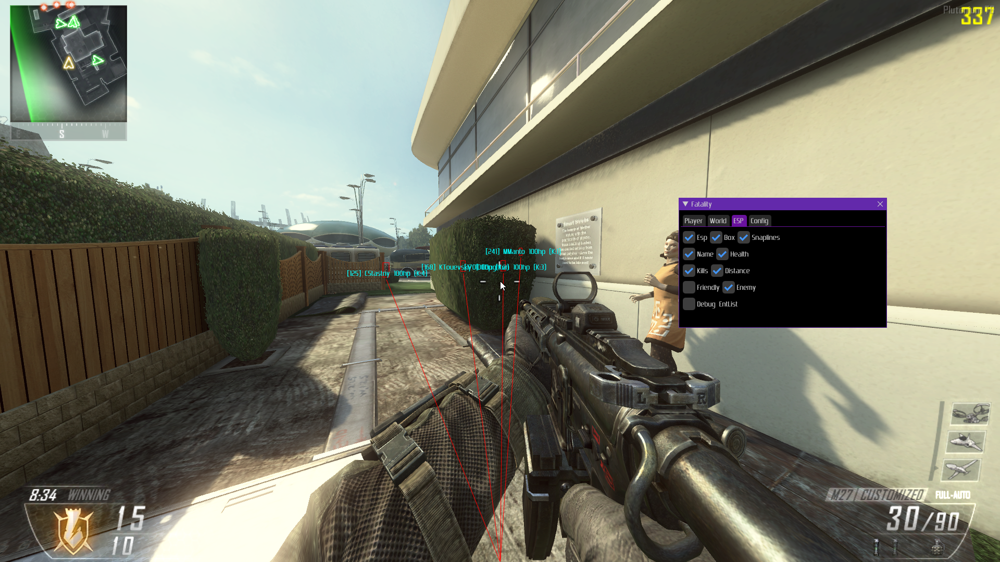
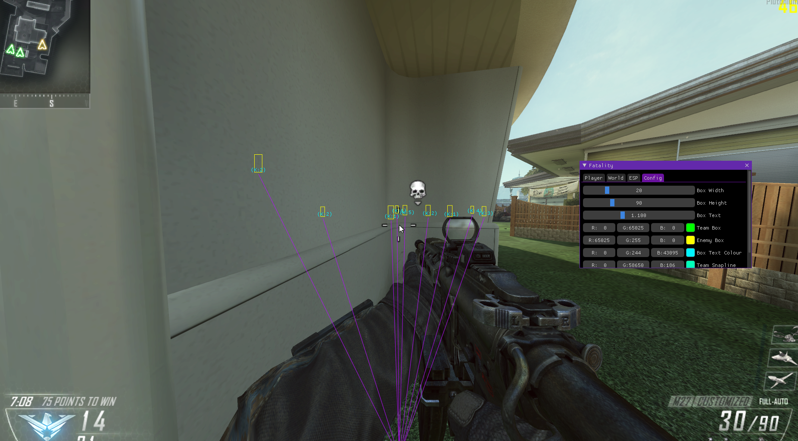

# BO2-Plutonium-Internal-Cheat-Bots-Only
BO2 Plutonium Internal Cheat Bots Only, unfinished cheat
<h3 align="center">Cheat only works on bots, the cheat is unfinished and just uploaded as informational material to others.</h3>

  

    
     
    <a href="https://iiferedon.xyz"><strong>My Website »</strong></a>
     
     
  

This was made before ChatGPT was made so give me some slack. :P

This cheat uses the MinHook library to trampoline hook the 'present' function in the directx11 interface of the game. It then uses the swapchain address to pass to the ImGui library to then draw to the screen. Since the cheat is internal, i can use classes as pointers to get cheat information on basic player classes, the offsets I found myself. The viewmatrix is also included in here to display esp and get relative WTS addresses through multiple functions to display players through walls. Aimbot was never finished although attempted, kinda got bored ngl.
You can use a basic LoadLibrary, standard CreateRemoteThread dll injector (CreateToolhelp32Snapshot() + Module32First/Next() is okay, they claim to have anti-cheat but I only noticed detection when attaching a VEH or windows debugger, they have nothing on kernel driver debugging :) ), manual mapping is possible depending on the injector tbh but its not needed T6MP aint that special. Usermode applications cannot detect RPM and WPM functions. 
https://github.com/master131/ExtremeInjector use this

    
  

